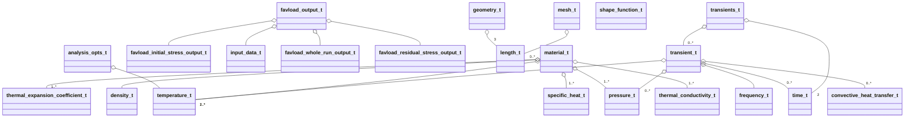

<h1 align="center">Favload</h1>

```mermaid
classDiagram

analysis_opts_t o-- temperature_t

class favload_initial_stress_output_t

favload_output_t o-- input_data_t
favload_output_t o-- favload_whole_run_output_t
favload_output_t o-- favload_initial_stress_output_t
favload_output_t o-- favload_residual_stress_output_t

class favload_residual_stress_output_t
class favload_whole_run_output_t
class favload_initial_stress_output_t

geometry_t o-- "3" length_t

material_t o-- "1..*" thermal_conductivity_t
material_t o-- "1..*" specific_heat_t
material_t o-- density_t
material_t o-- "1..*" pressure_t
material_t o-- "1..*" temperature_t
material_t o-- "1..*" thermal_expansion_coefficient_t

mesh_t o-- "0..*" length_t

class shape_function_t

transient_t o-- "0..*" time_t
transient_t o-- "0..*" convective_heat_transfer_t
transient_t o-- "2..*" temperature_t
transient_t o-- "0..*" pressure_t
transient_t o-- frequency_t

transients_t o-- "0..*" transient_t
transients_t o-- "2" time_t
```
# 
