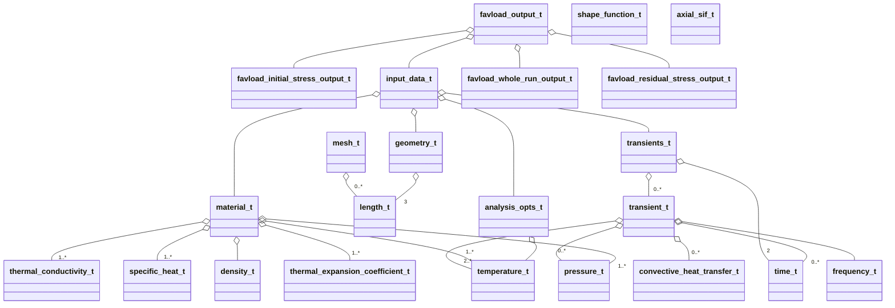

<h1 align="center">Favload</h1>

```mermaid
classDiagram

analysis_opts_t o-- temperature_t

class favload_initial_stress_output_t

favload_output_t o-- input_data_t
favload_output_t o-- favload_whole_run_output_t
favload_output_t o-- favload_initial_stress_output_t
favload_output_t o-- favload_residual_stress_output_t

class favload_residual_stress_output_t
class favload_whole_run_output_t
class favload_initial_stress_output_t

geometry_t o-- "3" length_t

input_data_t o-- geometry_t
input_data_t o-- material_t
input_data_t o-- analysis_opts_t
input_data_t o-- transients_t


material_t o-- "1..*" thermal_conductivity_t
material_t o-- "1..*" specific_heat_t
material_t o-- density_t
material_t o-- "1..*" pressure_t
material_t o-- "1..*" temperature_t
material_t o-- "1..*" thermal_expansion_coefficient_t

mesh_t o-- "0..*" length_t

class shape_function_t

class axial_sif_t

transient_t o-- "0..*" time_t
transient_t o-- "0..*" convective_heat_transfer_t
transient_t o-- "2..*" temperature_t
transient_t o-- "0..*" pressure_t
transient_t o-- frequency_t

transients_t o-- "0..*" transient_t
transients_t o-- "2" time_t
```

<h1 align="center">Favpfm</h1>

```mermaid
classDiagram

analysis_spec_t o-- "2" time_t

as_found_flaw_t o-- "3" varying_string
as_found_flaw_t o-- "2" length_t
as_found_flaw_t o-- temperature_t

pfm_run_type_t <|-- deterministic_critical_rtndt_t  

pfm_run_type_t <|-- deterministic_history_t 
deterministic_history_t o-- length_t

class deterministic_minimization_result_t

pfm_run_type_t <|-- deterministic_profile_t 
deterministic_profile_t o-- time_t


failure_mech_report_t o-- "5" failure_data_t


favpfm_analysis_output_t o-- "0..*" transient_seq_t
favpfm_analysis_output_t o-- "0..*" flaw_stats_t

favpfm_output_t <|-- favpfm_deterministic_hist_e_output_t
favpfm_deterministic_hist_e_output_t o-- "2" varying_string
favpfm_deterministic_hist_e_output_t o-- "7" length_t
favpfm_deterministic_hist_e_output_t o-- "0..*" transient_hist_t

favpfm_output_t <|-- favpfm_deterministic_hist_s_output_t 
favpfm_deterministic_hist_s_output_t o-- "2" varying_string
favpfm_deterministic_hist_s_output_t o-- "5" length_t
favpfm_deterministic_hist_s_output_t o-- "0..*" transient_hist_t

favpfm_output_t <|-- favpfm_deterministic_prof_e_output_t
favpfm_deterministic_prof_e_output_t o-- "2" varying_string
favpfm_deterministic_prof_e_output_t o-- "5" length_t
favpfm_deterministic_prof_e_output_t o-- "0..*" transient_prof_t


favpfm_output_t <|-- favpfm_deterministic_prof_s_output_t
favpfm_deterministic_prof_s_output_t o-- "2" varying_string
favpfm_deterministic_prof_s_output_t o-- "4" length_t
favpfm_deterministic_prof_s_output_t o-- time_t
favpfm_deterministic_prof_s_output_t o-- "0..*" transient_prof_t


favpfm_output_t <|-- favpfm_deterministic_rtndt_output_t
favpfm_deterministic_rtndt_output_t o-- "0..*" transient_flaws_t

favpfm_failure_output_t o-- "0..*" flaw_dists_t
favpfm_failure_output_t o-- "0..*" prob_fracture_mech_t 

favpfm_initiate_output_t o-- "0..*" transient_output_t
favpfm_initiate_output_t o-- "0..*" prob_fracture_mech_t

class favpfm_output_t

favpfm_output_t <|-- favpfm_probabilistic_output_t
favpfm_probabilistic_output_t o-- favpfm_initiate_output_t
favpfm_probabilistic_output_t o-- favpfm_failure_output_t
favpfm_probabilistic_output_t o-- favpfm_analysis_output_t

class flaw_cp_t

flaw_depth_interval_t o-- "2" length_t

class flaw_dist_pct_ac_t

class flaw_dist_pct_t

flaw_dists_t o-- "0..*" flaw_dist_pct_t
flaw_dists_t o-- "0..*" flaw_dist_pct_ac_t

flaw_type_t <|-- flaw_embedded_t
flaw_embedded_t o-- varying_string
flaw_embedded_t o-- length_t

flaw_material_category_t o-- varying_string
flaw_material_category_t o-- flaw_cp_t

flaw_material_data_t o-- "0..*" flaw_material_category_t
flaw_material_data_t o-- "3" flaw_material_total_t

flaw_material_report_t o-- "2" subregion_material_report_t

flaw_material_total_t o-- "2" flaw_cp_t

class flaw_size_category_t

flaw_size_data_t o-- "0..*" flaw_size_dist_entry_t
flaw_size_data_t o-- flaw_size_total_t

flaw_size_dist_entry_t o-- length_t
flaw_size_dist_entry_t o-- flaw_depth_interval_t
flaw_size_dist_entry_t o-- flaw_size_category_t

flaw_size_report_t o-- "4" flaw_size_data_t

flaw_size_total_t o-- flaw_size_category_t

class flaw_stats_t

flaw_type_t <|-- flaw_surface_t
flaw_surface_t o-- "2" varying_string

class flaw_tracking_t 

class flaw_type_t 

hist_init_forces_t o-- fracture_toughness_t

history_t <|-- history_emb_t
history_emb_t o-- time_t
history_emb_t o-- temperature_t
history_emb_t o-- "3" pressure_t
history_emb_t o-- fracture_toughness_t

class history_t

history_t <|-- history_surf_t
history_surf_t o-- time_t
history_surf_t o-- temperature_t
history_surf_t o-- "2" pressure_t
history_surf_t o-- "4" fracture_toughness_t

class pfm_file_names_t

class pfm_input_data_t

class pfm_run_type_t

class plate_cpf_output_t

class plate_cpi_output_t

plate_flaw_output_t o-- plate_cpi_output_t
plate_flaw_output_t o-- plate_cpf_output_t

class prob_fracture_mech_t

probabilistic_run_type_t <|-- prob_sim_flaw_log_t
prob_sim_flaw_log_t o-- prob_sim_properties_t
prob_sim_flaw_log_t o-- flaw_tracking_t
prob_sim_flaw_log_t o-- "0..*" subregion_t

probabilistic_run_type_t <|-- prob_sim_t
prob_sim_t o-- prob_sim_properties_t
prob_sim_t o-- "0..*" subregion_t

prob_sim_properties_t o-- temperature_t
prob_sim_properties_t o-- time_t
prob_sim_properties_t o-- pressure_t
prob_sim_properties_t o-- fracture_toughness_t


probabilistic_run_type_t <|-- prob_sim_time_interval_flaw_log_t
prob_sim_time_interval_flaw_log_t o-- prob_sim_properties_t
prob_sim_time_interval_flaw_log_t o-- flaw_tracking_t
prob_sim_time_interval_flaw_log_t o-- "0..*" subregion_t
prob_sim_time_interval_flaw_log_t o-- "0..*" analysis_spec_t

probabilistic_run_type_t <|-- prob_sim_time_interval_t
prob_sim_time_interval_t o-- prob_sim_properties_t
prob_sim_time_interval_t o-- "0..*" subregion_t
prob_sim_time_interval_t o -- "0..*" analysis_spec_t

pfm_run_type_t <|-- probabilistic_run_type_t

profile_t <|-- profile_emb_t
profile_emb_t o-- "2" length_t
profile_emb_t o-- temperature_t
profile_emb_t o-- "3" pressure_t
profile_emb_t o-- fracture_toughness_t


class profile_t

profile_t <|-- profile_surf_t
profile_surf_t o-- time_t
profile_surf_t o-- temperature_t
profile_surf_t o-- "2" pressure_t
profile_surf_t o-- "4" fracture_toughness_t

rpv_report_t o-- temperature_t 
rpv_report_t o-- "2..*" subregion_report_t


subregion_t o-- "2" temperature_t
subregion_t o-- angle_t
subregion_t o-- length_t
subregion_t o-- area_t

subregion_material_report_t o-- "2" flaw_material_data_t

subregion_output_t o-- total_cp_output_t


subregion_report_t o-- temperature_t
subregion_report_t o-- "3" flaw_cp_t

subregion_report_total_t o-- "3" flaw_cp_t

class surface_3d_sif_t

time_dist_report_t o-- time_t 


class total_cp_output_t

transient_flaws_t o-- "0..*" as_found_flaw_t

class transient_hist_t

transient_output_t o-- "0..*" weld_flaw_output_t
transient_output_t o-- "0..*" plate_flaw_output_t
transient_output_t o-- "0..*" subregion_output_t

class transient_prof_t 

transient_seq_t o-- "2" flaw_material_report_t
transient_seq_t o-- flaw_size_report_t
transient_seq_t o-- failure_mech_report_t
transient_seq_t o-- "0..*" hist_init_forces_t
transient_seq_t o-- "0..*" time_dist_report_t
transient_seq_t o-- rpv_report_t

class weld_cpf_output_t

class weld_cpi_output_t

weld_flaw_output_t o-- weld_cpi_output_t
weld_flaw_output_t o-- weld_cpf_output_t
```
<h1 align="center">Favpost</h1>

```mermaid

classDiagram

class post_command_args_t

class favpost_convergence_t

class favpost_cpi_cpf_summary_t

class favpost_distribution_t

class favpost_flawcat_init_freq_frac_t

class favpost_frequency_t

class favpost_init_freq_frac_t

favpost_output_t o-- favpfm_probabilistic_output_t
favpost_output_t o-- post_input_data_t
favpost_output_t o-- favpost_init_freq_frac_t
favpost_output_t o-- favpost_flawcat_init_freq_frac_t
favpost_output_t o-- "0..*" favpost_hist_stats_t
favpost_output_t o-- "0..*" favpost_distribution_t
favpost_output_t o-- "0..*" favpost_cpi_cpf_summary_t
favpost_output_t o-- "0..*" favpost_convergence_t
favpost_output_t o-- "0..*" favpost_frequency_t

class post_arguments_t

post_input_data_t o-- "0..*" transient_pdf_t


transient_pdf_t o-- "0..*" frequency_t
```
