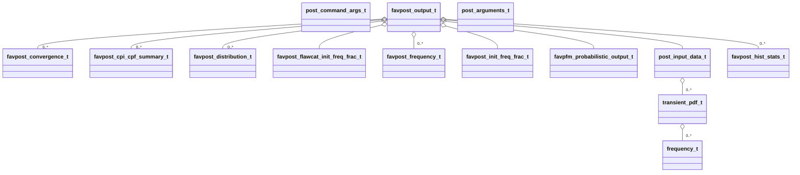

<h1 align="center">Favload</h1>

![pfm](https://mermaid.ink/svg/pako:eNq1Wclu6zYU_RWBy8IxPNYDuuz2rd6uECAwEmUTlSiVpPLqpPn3ktTEUZLzWgSILd5z7sRL8or-AGmVIXAFaQEZ-x3DG4VlTGICCSweDLOE1ShNeFS9vEQx2MUg4rhECVcYluRVQ7IkL-CPAbMXmDdIH5jcEsap-AghpbYCkRu_S30-DEdljSjkDe1M1nmZ0IYk_FGLkei3fwQoQxzREhPMOE6TlGLxAYuEcpJxgYmW8e7io6IPIYxJSCJdGh2OiUqapUd-KfE75LgiCUWsKfhS12ta5bhAHhdGicrKMAPyL4e4kPkpUXoXBuuK8iHDR5HhXp5BDntWDt-kO8MkVw2vm5G2Wa9_kTNNIWEYEZ4w9JekLqOp-WMcctaa61gDWEXeDbqZTtCAHKiTKK2Y7LJ7gn4yavEJopMrBftK4Fo-pzxgPxe5Qz8ujJz9L5HLyp6fcgv1bOB--oLA_UQncAUzl9bS0Nmi0NnPhe7QDwtDt4j9xvOEpf8oV-1mPpMqExRyQG5P5s7U75AT21kmLDDN8DRFxPia5BSmfNiYeaQZFA5zDPl8YTkBzzB9hseDykr33AxIZfAVF21yHVf8YuVPyNknuHaCn6A6x5OWATmXad3FriYW1WIRYCLq6E00Df7WxKDLUkjqlCcwDcs0A23lBGqqBy-F9jbbHknrJNQAKl9RlqFs0DgOKKXOjuHB6FEreSlmkGKRm1R8uY2NkFdZCOwmfkC2fYknaI-uSe7eIfKKy_-uTatNkrPNmleKbrJpc1Auv1Os0Y0AtYpg-B0ZAXSq1Hgw9Faq-g3CtcBt1jhoh-posCZ3AuRdF_OMyUithB_MQIfO1IlnUr2eZq3d9C4N1tAcpmgMpH-eOFANC2JTTv-U0nYn1yWtLTmqOiC57YlXGZqifjEPOzKvmtudINa5Or5ZKEf7R7Eipdx4NM5fj8R8UXIB7fKoxQsJC2JCbraxDs5OeC6zqutun72-6yK_8xqinR-f9wZIldVkEOpokW9SBJbIkWAiz4uxHEfJ-OKmjRfybEvr3HPQ9DJsyNpRVTTGweVDz2G9VgPHv3lm2i-hisVw2Rorqpsy7w625vtx8UVMGsdtFkNwa-mEgcP-N-7Dz7iua17m6LxZh-0r1glgV_BhhF7PYVSooJfnRjoy7OTeSQ5BlmVyihwugEmaf16e5Fp3WF9OWdjyVxL0hQAFJZoLzHO7FAq2S0R3o9RD1WN39BiP3pbYRbgLw1FhH0EuJlzsww7Xuj0RQ38Imc_2mnREfvcnDyEvaOoQovWb2QoZViMPQBi160RvS2Oi1Y9-SWtGY4MguRVewTjBDoWi7lSc6JTththq1E22ebWg-j3RQOunmo4Opy2I0l4J-s7cRRqd_N7fyffN4j4Ti7O7vVClpDph0zNVYZFes97QnPsIa-syL8M1ZZ7bNve-wFT2AxWZ2UnMczztxzzJnVuf4-0NUGR6rm6Yg-UzlryP4b5mBHC-m_KQE11Ibkc_Q3Drwk_QV_qYJTVV_uauE5kdpTu1SrkHO40cDYIVKBEtIc7AFXzEJBKh8TsqUQyu4muGctgUPAYx-RRQ2PDq-4Ok4Mppg1agqcVKR93vSOCaw4KJUZRh0ax_635pkh8rUEMCrh_gb3B92Z8v693xfDpt9qf9r8fT9rQCDzF-2azPm_Npczgedpfzfn_-XIH3qhJ6d-vtZnvZHraH3WZ33m0vJ6XwDyWUnnz-C4MsKxs)

<h1 align="center">Favpfm</h1>

<h1 align="center">Favpost</h1>

